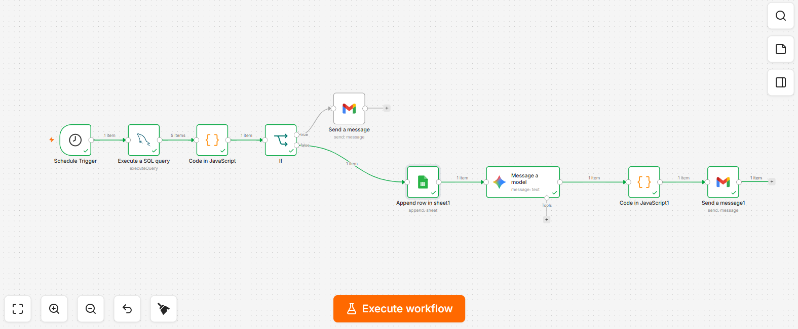

# Daily Sales Automation (n8n)

An automated pipeline that generates and sends a daily sales report — fully hands-off, no manual reporting needed.

## How it works

1. **Schedule Trigger** — runs automatically every day at 8 AM
2. **MySQL Query** — pulls yesterday's sales data (product, quantity, revenue)
3. **Code Node** — calculates total revenue, total quantity, and top-selling product
4. **Conditional Check** — if revenue falls below ₹5,00,000, triggers a low-sales alert email
5. **Google Gemini AI** — generates a professional written summary of the day's performance
6. **Google Sheets** — logs the day's data for historical tracking
7. **Gmail** — sends the AI-generated report to stakeholders

## Tech Stack

n8n · MySQL · Google Gemini API · Google Sheets API · Gmail API

## Key Features

- **Zero manual effort** — runs on a daily schedule without any human trigger
- **Smart alerting** — automatically flags underperforming sales days
- **AI-generated summaries** — uses Gemini to turn raw numbers into a readable business report
- **Historical logging** — every day's data is appended to Google Sheets for trend tracking

## Why I built this

To eliminate manual daily sales reporting — replacing a repetitive task with a fully automated pipeline that alerts on underperformance and keeps a running data log automatically.

## Setup

1. Import `Daily_Sales_Automation.json` into your n8n instance
2. Configure credentials for MySQL, Gmail, Google Sheets, and Google Gemini API
3. Update the SQL query and Sheet ID to match your own data source
4. Activate the workflow
